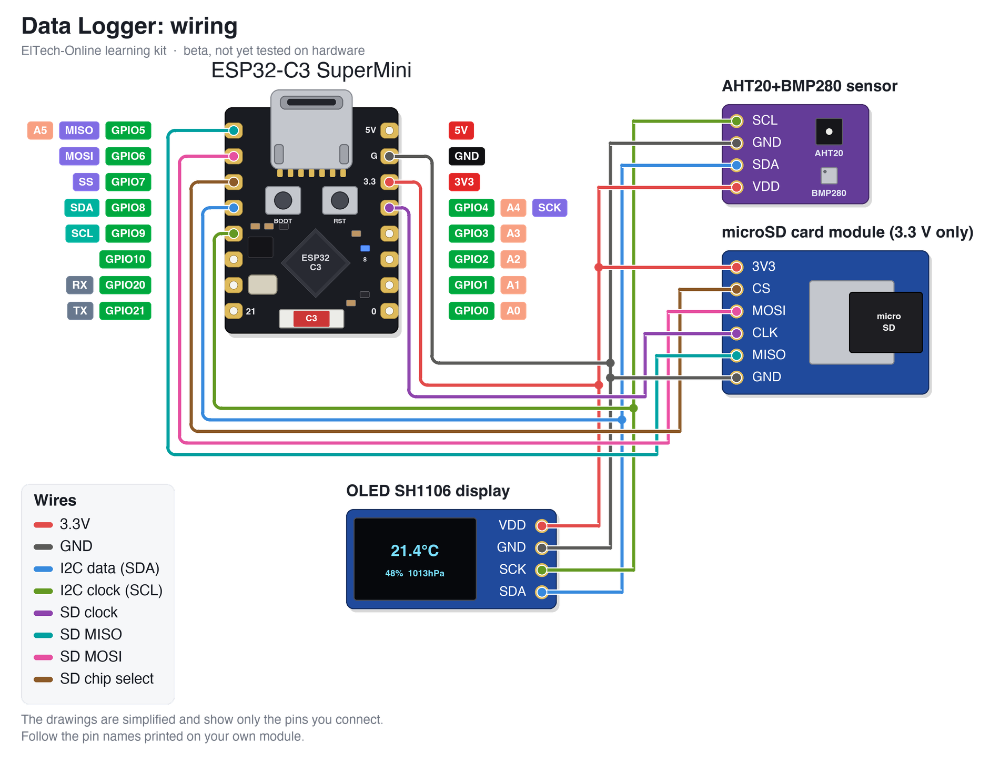

# ElTech-Online ESP32-C3 Data Logger

[](https://buymeacoffee.com/eltech)

> **Status: BETA, not tested.** The code compiles for the ESP32-C3, but this kit has not been built and tested on real hardware yet. Pin choices, default values and the wiring may still change. Use it to read and learn from; expect to do some fault-finding if you build it now.

A beginner-friendly **learning kit**: build a data logger from an **ESP32-C3 SuperMini**, an **AHT20+BMP280** temperature, humidity and pressure sensor, a **microSD card module** and a **1.3" OLED SH1106** display. It writes a row to a spreadsheet file on the card every minute, and you download the file from the web page the board hosts. No prior electronics or coding experience needed, and no soldering: everything plugs into a breadboard.

Designed, coded and documented by ElTech-Online in Callander, Scotland — the kit design, firmware and this guide are our own work.


## What you'll learn

The new technique in this kit is storage:

- **The SPI bus** — four wires (clock, data out, data in, chip select) and what each one does
- **Files on an SD card** — creating a file, adding to it, reading it back and deleting it
- **CSV files** — the simplest data format there is, opened by any spreadsheet program
- **Keeping time** — getting the date and time from your phone, since the board has no clock battery

Along the way you'll also pick up:

- **I2C** — the sensor and the OLED share two wires, each answering to its own address
- **Sending a file from a web server**, in pieces, so it can be far bigger than the board's memory
- **Coping with a missing card** — the logger notices, and carries on when a card is put back

The code is written to be read: every section is commented in plain language, and [How the code works](#how-the-code-works) walks through it.

## How SPI and the SD card work

SPI is a fast way for a board to talk to a part over four wires:

| Wire | Stands for | Job |
|---|---|---|
| `CLK` (SCK) | clock | Ticks once for every bit, so both ends stay in step |
| `MOSI` | master out, slave in | Data from the board to the card |
| `MISO` | master in, slave out | Data from the card to the board |
| `CS` | chip select | The board pulls this LOW to say "I am talking to you" |

Several SPI parts can share the first three wires, each with its own CS wire. Compare that with I2C (the sensor and OLED), which needs only two wires because every part has an address.

The card itself is formatted **FAT32**, the same as for a camera or a computer, so the file the board writes can be read by anything. The sketch opens the file, adds one line and **closes it again** for every row: closing is what really saves the data, so you can pull the power at any moment and lose at most one row.

> **This microSD module is 3.3 V only.** Connect its `3V3` pin to the board's `3V3`, never to `5V`.

## What it does

- Reads temperature, humidity and air pressure every 2 seconds
- Adds a row to `log.csv` every 60 seconds (changeable from 2 seconds to 1 hour on the web page)
- OLED: the readings, how many rows are logged and a countdown to the next one
- Web page: live readings, card status, file size, the last row, **Download log.csv** and **Delete the file**
- Opening the web page sets the board's clock from your phone, so rows get real dates and times. Before that they are stamped with the time since power-on

It also runs a self-test at power-on and prints it to Serial (115200 baud):

```
--- Self-test ---
OLED (SH1106): OK
AHT20:         OK
BMP280:        OK
SD card:       OK (30436 MB card)
WiFi AP:       OK
RESULT:        PASS
```

The self-test needs a card in the module to pass.

There are **two sketches** in this repo:

| Sketch | What it is |
|---|---|
| `sd_card_test/` | The smallest useful start: writes one line to a file and reads the file back. Begin here. |
| `data_logger/` | The full project: sensor + SD card + OLED + web page. |

## Hardware

| Component | Notes |
|---|---|
| ESP32-C3 SuperMini |  |
| AHT20+BMP280 sensor module | 4 pins: `SCL`, `GND`, `SDA`, `VDD` |
| microSD card module, 3.3 V type | 6 pins: `3V3`, `CS`, `MOSI`, `CLK`, `MISO`, `GND` |
| 1.3" OLED, SH1106 driver, 128×64, I2C | Address `0x3C` (try `0x3D` if blank) |
| Breadboard + jumper wires | 14 wires |
| microSD card | Not in the kit. Any card of 32 GB or less, formatted FAT32 |

## Wiring

| Wire | ESP32-C3 pin | Connects to |
|---|---|---|
| 3.3V | 3V3 | AHT20+BMP280 sensor `VDD`, microSD card module `3V3`, OLED SH1106 display `VDD` |
| GND | GND | AHT20+BMP280 sensor `GND`, microSD card module `GND`, OLED SH1106 display `GND` |
| I2C data (SDA) | GPIO 8 | AHT20+BMP280 sensor `SDA`, OLED SH1106 display `SDA` |
| I2C clock (SCL) | GPIO 9 | AHT20+BMP280 sensor `SCL`, OLED SH1106 display `SCK` |
| SD clock | GPIO 4 | microSD card module `CLK` |
| SD MISO | GPIO 5 | microSD card module `MISO` |
| SD MOSI | GPIO 6 | microSD card module `MOSI` |
| SD chip select | GPIO 7 | microSD card module `CS` |



The parts are drawn in a simplified way, showing only the pins you connect. **Always follow the labels printed on your own modules** — the pin order differs between manufacturers.

Good to know:

- **Everything runs on 3V3.** Use the breadboard's power rails for 3V3 and GND.
- **GPIO 4, 5, 6 and 7** are the ESP32-C3 SuperMini's labelled SPI pins (SCK, MISO, MOSI, SS).
- **GPIO 8 and 9** are its labelled I2C pins (SDA, SCL), shared by the sensor and the OLED.

## Setup (Arduino IDE)

**Before you start:** download and install the free **Arduino IDE 2** from [arduino.cc/en/software](https://www.arduino.cc/en/software). The ESP32-C3 connects over its own USB-C port, so there's no separate USB driver to install. Use a USB cable that carries data: some cheap cables only charge, and then the board never shows up.

1. **Add the ESP32 board index**: `File > Preferences` → Additional Boards Manager URLs:
   ```
   https://raw.githubusercontent.com/espressif/arduino-esp32/gh-pages/package_esp32_index.json
   ```
2. **Install the board package**: `Tools > Board > Boards Manager`, search "esp32", install **esp32 by Espressif Systems**.
3. **Select the board**: `Tools > Board > esp32 > ESP32C3 Dev Module`.
4. **Tools menu settings**:

   | Setting | Value |
   |---|---|
   | Board | ESP32C3 Dev Module |
   | USB CDC On Boot | Enabled |
   | CPU Frequency | 160MHz |
   | Erase All Flash Before Sketch Upload | Disabled |
   | Flash Size | 4MB (32Mb) |
   | Partition Scheme | Default 4MB with spiffs (1.2MB APP/1.5MB SPIFFS) |
   | Upload Speed | 921600 |

5. **Install libraries** via `Sketch > Include Library > Manage Libraries`:
   - Adafruit AHTX0
   - Adafruit BMP280 Library
   - Adafruit SH110X
   - Adafruit GFX Library

   If Library Manager asks to install dependencies (Adafruit BusIO, Adafruit Unified Sensor), click **Install all**.

   **Compiled with** these versions (compile-tested only; hardware confirmation pending):

   | Package | Version |
   |---|---|
   | esp32 by Espressif Systems (board package) | 3.3.11 |
   | Adafruit AHTX0 | 2.0.6 |
   | Adafruit BMP280 Library | 3.0.0 |
   | Adafruit SH110X | 2.1.15 |
   | Adafruit GFX Library | 1.12.6 |
   | Adafruit BusIO | 1.17.4 |
   | Adafruit Unified Sensor | 1.1.15 |

6. Open `sd_card_test/sd_card_test.ino` first, upload it, and check the card works. Then open `data_logger/data_logger.ino` and upload that.

### Opening the Serial Monitor

1. Open it with `Tools > Serial Monitor`.
2. Set the speed drop-down to **115200 baud**. At the wrong speed, you'll see garbled characters or nothing at all.
3. The self-test only runs once, right after the board starts. If you opened the Serial Monitor too late, press the board's **RST** (reset) button to run it again.

**Seeing nothing at all?** Check that `Tools > USB CDC On Boot` is set to **Enabled**.

### If the upload fails

If the upload stops with an error like `Failed to connect`, put the board into download mode by hand:

1. Hold down the **BOOT** button on the board.
2. While holding it, press and release **RST** (or unplug and re-plug the USB cable).
3. Release **BOOT**, choose the port under `Tools > Port` and click **Upload** again.
4. When the upload finishes, press **RST** once to start the new code.

## The web page

1. Upload the main sketch. Every board creates its **own** network name (e.g. `ElTech-DL-A3F2`) and its **own** random 8-character password, saved in the board's flash memory.
2. The OLED and Serial Monitor show the network name, the password and the address `http://192.168.4.1`.
3. On your phone or laptop, connect to that WiFi network, then open that address in a browser. Your phone may warn that the network has no internet: that is expected, stay connected.

This is a standalone Access Point, not connected to your home WiFi or the internet. Range is roughly a typical room. The WiFi code and the page's style sheet live in `eltech_wifi.h`, a second tab in the sketch, so the main file can stay about this kit's own lesson.

## Getting your data

1. Open the web page and press **Download log.csv**.
2. Open the file in any spreadsheet program (Excel, Numbers, Google Sheets, LibreOffice).
3. Select the columns and insert a line chart.

The file looks like this:

```
time,temperature_c,humidity_pct,pressure_hpa
2026-10-06 14:03:20,21.4,48.2,1013.6
2026-10-06 14:04:20,21.5,48.0,1013.6
```

You can also switch the board off, take the card out and read it in a computer.

## How the code works

Open `data_logger/data_logger.ino` alongside this section. The file starts with a short guide to its own layout. Every Arduino sketch has two main functions: `setup()` runs once when the board starts, and `loop()` then runs over and over, forever.

1. **Settings at the top.** Pins, the file name and the default interval are named values you can change in one place.
2. **The clock.** `setClock()` takes the phone's time; `timeStamp()` turns the board's clock into text for a row.
3. **Starting the card.** `startCard()` tells the SPI bus which pins to use and mounts the card.
4. **Writing a row.** `logRow()` opens the file for appending, writes one line, and closes it.
5. **The web server.** `/data` sends readings and status as JSON; `/download` streams the file; `/clear`, `/interval` and `/settime` change things.
6. **Two timers in `loop()`.** One reads the sensors every 2 seconds, one writes a row every interval, both using `millis()` so the web page always answers.

## Try this next

Small changes to try yourself, roughly easiest first. Change one thing, upload, and check the result before moving on.

1. **Log faster.** Set the interval to 5 seconds on the web page, breathe on the sensor, and chart the result.
2. **Add a column.** Add the dew point or the temperature in °F to the row in `logRow()` (and to the title row).
3. **Start a new file each day.** Build the file name from the date once the clock is set.
4. **Log only when something changes**, for example when the temperature has moved by 0.2 °C.
5. **Show the minimum and maximum** temperature since power-on on the OLED.

## Beta notes

This repository is published early. Still to be confirmed on real hardware:

- The microSD module at the default SPI speed on a breadboard (lower it with `SD.begin(SD_CS, SPI, 4000000)` if cards fail to mount)
- Download of large files over the board's WiFi
- Sketch size: this is the largest sketch in the series, at about 86 % of the default program space

Found a problem? Please open an issue on this repository.

## License

The code, documentation and wiring diagram are MIT-licensed — see [LICENSE](LICENSE). Use them, modify them, build your own kit with them.

**The ElTech-Online name and logo are not covered by the MIT license.** The logo files (`logo.png` and any `logo_bitmap.h`) are © ElTech-Online, all rights reserved. If you build or sell your own version, swap in your own logo and don't present it as an ElTech-Online product.
